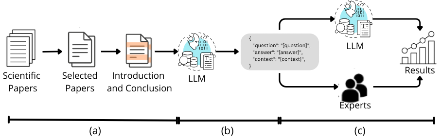
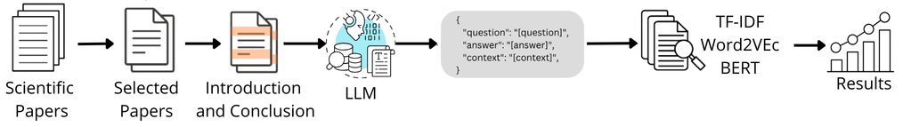

# Fine-Grained Evaluation of a Domain-Specific Q&A Dataset to Support Trustworthy Medical Language Models

First and foremost, thanks for your interest in using our HemoQAL dataset! The effective use of Large Language Models (LLMs) for generating coherent and informative content in specialized domains has largely been driven by the development of robust evaluation strategies. Based on this assumption, we introduce HemoQAL, a question-and-answer (Q&amp;A) dataset on hemophilia, derived from recent scientific publications and clinical guidelines. Our main contribution lies in conventional and human-centered evaluation approaches to assess the quality of LLM-generated content. First, we carried out a human evaluation in which medical experts assessed the factual accuracy and educational value of the generated Q&amp;A pairs. Second, we conducted a semantic similarity analysis to quantitatively evaluate the alignment between each Q&amp;A pair and its original source material. These lightweight, scalable semantic metrics offer an efficient alternative to more resource-intensive human or LLM-based evaluation pipelines. Our findings show that integrating expert review with semantic similarity measures improves the reliability and trustworthiness of LLM-generated medical content, contributing to the development of dependable AI tools in health informatics.

Since our work aims to assess the reliability and contextual alignment of Q\&amp;A generated by a general-purpose LLM in the hemophilia domain, we address the challenge of evaluating the consistency and relevance of the generated content. To do this, we first created a specialized Q&amp;A dataset based on hemophilia-related texts, followed by two complementary experiments:

- Content validation through a Human Judgment Analysis to ensure quality and educational value;
- Semantic Similarity Analysis by leveraging TF-IDF for keyword overlap, Word2Vec for basic semantic relationships, and BERT for deep contextual understanding.

---

### Human Judgment Analysis

As illustrated in the following figure, we start the construction of our dataset by collecting and selecting the data specific to the hemophilia domain. Initially, we comprehensively reviewed 20,000 papers on hemophilia sourced from various scientific databases. In the next step, the extracted data was used by LLM (version GPT-4o-2024-05-13) to create question-and-answer pairs. Finally, in the last step, the pairs of question-and-answer obtained in the previous step were evaluated by both LLM and domain experts.

---

### Semantic Similarity Analysis

The semantic similarity analysis was conducted using the pipeline illustrated in the following figure. After constructing HemoQAL as described earlier, we processed pairs of texts through TF-IDF, Word2Vec, and BERT embeddings to assess their semantic alignment and contextual relevance. For the HemoQAL dataset, this involved evaluating the correspondence between: questions and their answers, LLM-generated contexts and the original source texts.

---

### Repository structure

The organization of this repository is:

> - **data** : raw and processed texts used in our study
> - **src** : source codes used to preprocess the texts
> - **img**: images and plots used in our experiments

On the behalf of all of the authors, we appreciate your interest in our data, code and models, and hope they are useful to your research.

